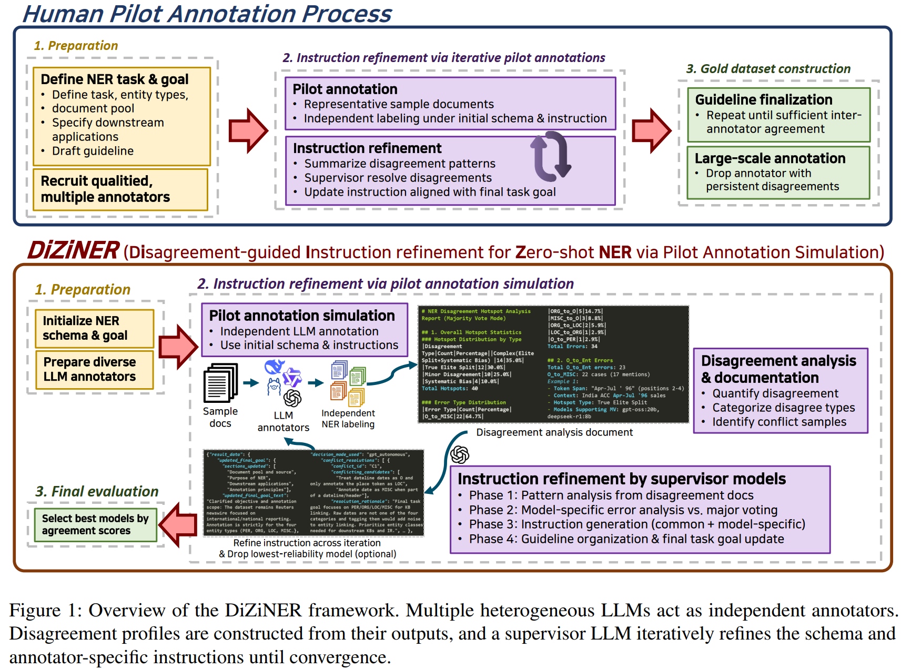
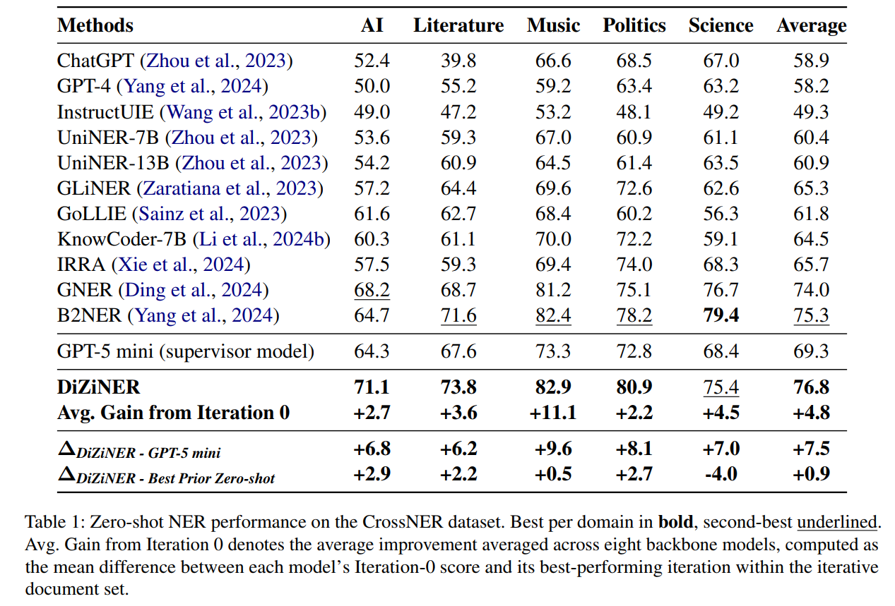
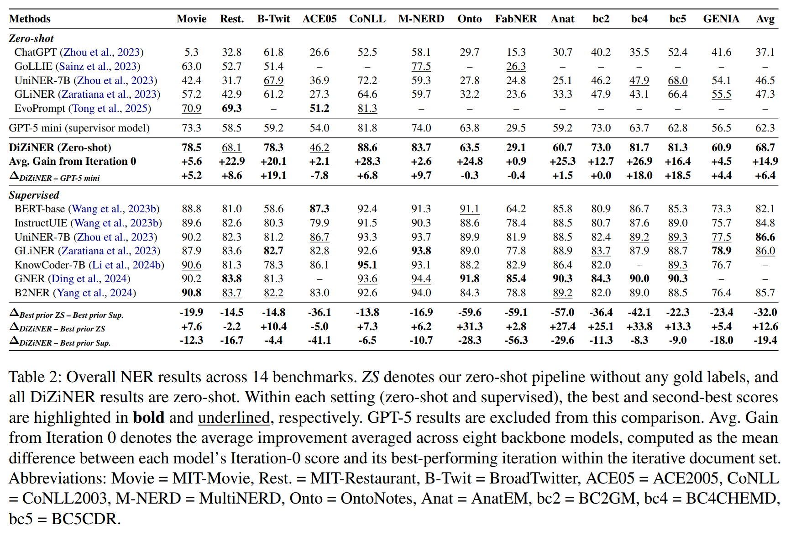
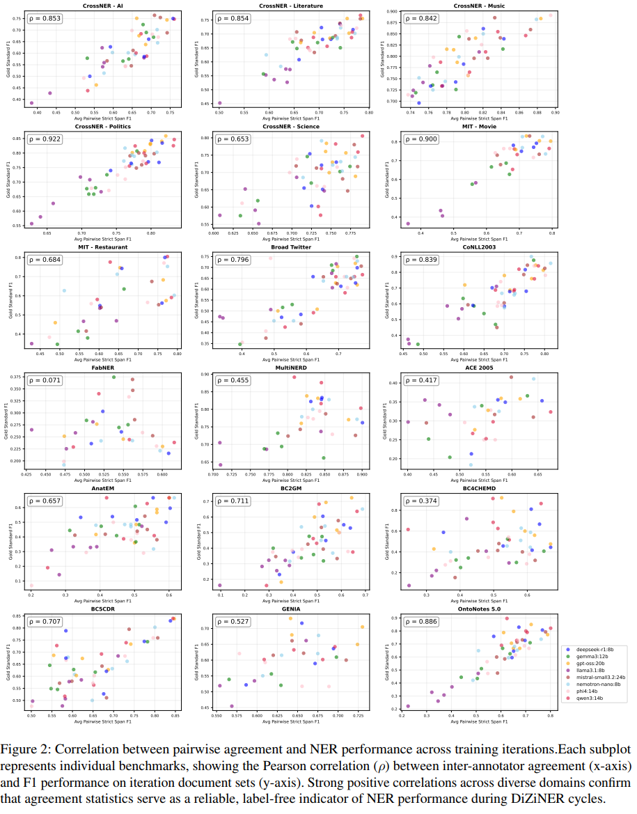
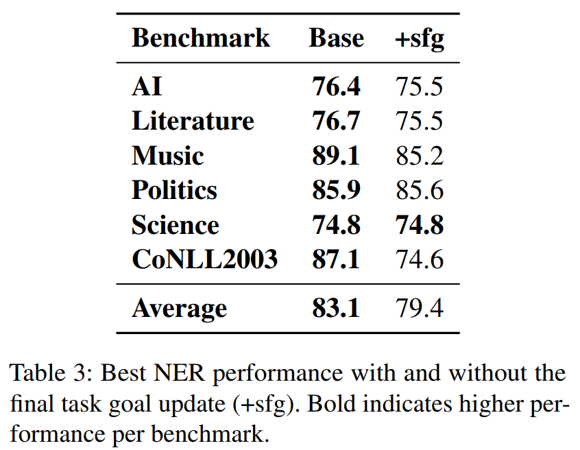

# DiZiNER: Disagreement-guided Instruction Refinement via Pilot Annotation Simulation for Zero-shot NER

Official implementation of **DiZiNER** (ACL 2025 submission), a framework that simulates human pilot annotation processes to achieve state-of-the-art zero-shot Named Entity Recognition through iterative disagreement-guided instruction refinement.

## Overview

DiZiNER mimics the human annotation workflow where multiple annotators independently label documents, supervisors analyze disagreements, and guidelines are iteratively refined until consensus is reached. By employing heterogeneous LLMs as annotators and a supervisor model for disagreement analysis, DiZiNER achieves new zero-shot SOTA on 13 out of 18 NER benchmarks without any task-specific fine-tuning.


## Key Features
- **Multi-Model Annotation**: Concurrent evaluation of multiple LLMs on NER tasks
- **Iterative Improvement**: Supervisor-guided refinement through multiple iterations
- **Comprehensive Analysis**: Agreement, disagreement, and error analysis
- **Parallel Processing**: Efficient concurrent model inference via OpenRouter
- **Flexible Data Grouping**: Lexical diversity-based sample selection
- **Model Dropping**: Dynamic removal of underperforming models
- **Gold Standard Support**: Optional supervision using ground truth labels

## Implementation Architecture
### Core Pipeline
**Experiment Orchestration** (`main_experiments.py`)
- Coordinates multi-iteration workflow across annotation → analysis → supervision phases
- Manages experiment configuration and result aggregation

**Annotation** (`annotation_runner.py`, `parallel_annotation.py`, `base_annotator.py`)
- Parallel model processing via ThreadPoolExecutor
- Supervisor instruction integration for iterative refinement
- Result caching and OpenRouter optimization

**Analysis** (`disagreement_analysis_in_pipeline.py`, `agreement_analysis_test.py`, `error_analysis.py`)
- Hotspot identification using disagreement metrics (Dconf, Dtype, Ubnd)
- Inter-annotator agreement calculation (Cohen's/Fleiss' Kappa)
- Error pattern categorization and documentation

**Supervision** (`supervisor_implementation.py`, `base_supervisor.py`)
- 4-phase instruction refinement:
  - Phase 1: Disagreement pattern extraction
  - Phase 2: Model-specific error diagnosis
  - Phase 3: Instruction hierarchization
  - Phase 4: Guideline organization and output

**Utilities** (`utils_experiments.py`, `utils_annotator.py`, `lexical_diversity_grouping.py`)
- Dataset grouping via K-means clustering on sentence embeddings
- BIO-entity conversion and metric calculation
- Model selection and result management

## Workflow
### Standard Experiment Flow
```
1. Dataset Preparation
   └─→ lexical_diversity_grouping.py
       └─→ Creates diverse sample groups

2. Baseline Annotation (Iteration 0)
   └─→ main_experiments.py
       ├─→ parallel_annotation.py
       │   └─→ annotation_runner.py
       │       └─→ base_annotator.py
       │           └─→ llm_clients.py
       └─→ Saves model results

3. Analysis Phase
   └─→ run_analysis_pipeline()
       ├─→ agreement_analysis_test.py
       ├─→ disagreement_analysis_in_pipeline.py
       └─→ error_analysis.py

4. Supervision Phase
   └─→ supervisor_implementation.py
       └─→ base_supervisor.py (4 phases)
           └─→ Generates enhanced guidelines

5. Next Iteration (1, 2, ...)
   └─→ Repeats steps 2-4 with updated guidelines
       └─→ Models use supervisor instructions
```

### Iterative Improvement Mechanism
Each iteration builds upon the previous:
1. **Annotation**: Models annotate samples using current guidelines
2. **Analysis**: System identifies disagreements and errors
3. **Supervision**: Supervisor generates improved guidelines based on analysis
4. **Update**: Next iteration uses new guidelines for annotation

The process continues until:
- Maximum iterations reached
- Performance convergence detected
- Manual stopping criteria met

## Configuration
### Experiment Parameters
```python
# Dataset and grouping
benchmark: str              # Dataset name
num_groups: int            # Number of sample groups
group_size: int            # Samples per group
group_index: int           # Which group to use

# Iteration control
max_iterations: int        # Maximum iteration count
starting_group_index: int  # Starting group number
convergence_threshold: float  # F1 improvement threshold

# Model selection
num_models: int            # Number of models to test
models: List[str]          # Specific model list
drop_worst_annr: bool      # Enable model dropping

# Supervision
supervisor_model_name: str # Model for generating guidelines
supervised_by_gold_standard: bool  # Use gold labels
max_common_instructions: int       # Common guideline limit
max_model_specific_instructions: int  # Per-model limit
limit_instruction_changes: bool    # Restrict updates
```

### Analysis Parameters

```python
# Analysis configuration
run_agreement_analysis: bool
run_disagreement_analysis: bool
run_error_analysis: bool
hotspot_percentile: float     # Disagreement threshold
coalition_cutoff: float       # Model grouping threshold
```

## Usage Examples

### Basic Experiment

```python
from main_experiments import main_iterative_experiment

results = main_iterative_experiment(
    benchmark="conllpp",
    num_models=5,
    max_iterations=3,
    supervisor_model_name="gpt-4",
    llm_infer_by_openrouter=True
)
```

### Advanced Configuration

```python
results = main_iterative_experiment(
    benchmark="ACE05",
    starting_group_index=0,
    num_models=8,
    max_iterations=5,
    convergence_threshold=0.02,
    drop_worst_annr=True,
    supervised_by_gold_standard=True,
    max_common_instructions=7,
    max_model_specific_instructions=4,
    limit_instruction_changes=True,
    max_change_ratio=0.3,
    supervisor_model_name="claude-sonnet-4"
)
```

### Extract and Test Final Prompts

```python
from get_final_test_prompts import FinalTestPromptsCollector

collector = FinalTestPromptsCollector(
    source_dir="experiment_results"
)
collector.collect_and_save_prompts(
    output_dir="final-test-prompts"
)

# Run inference on collected prompts
from inference_final_test_prompts import run_inference
run_inference(prompts_dir="final-test-prompts")
```

## Output Structure

```
experiment_results/
├── {benchmark}/
│   ├── models{N}/
│   │   ├── {supervisor_model}/
│   │   │   ├── g{groups}_s{size}_grp{idx}_iter{N}/
│   │   │   │   ├── model_results/
│   │   │   │   │   └── {model_name}.json
│   │   │   │   ├── agreement_analysis/
│   │   │   │   ├── disagreement_analysis/
│   │   │   │   │   └── hotspot_docs/
│   │   │   │   ├── error_analysis/
│   │   │   │   ├── supervisor_results/
│   │   │   │   │   ├── phase1_*.json
│   │   │   │   │   ├── phase2_*.json
│   │   │   │   │   ├── phase3_*.json
│   │   │   │   │   └── phase4_enhanced_guidelines.json
│   │   │   │   ├── prompts/
│   │   │   │   │   └── {model}_iter{N}_prompt_template.txt
│   │   │   │   ├── combined_results.json
│   │   │   │   ├── experiment_config.json
│   │   │   │   └── test_samples.pkl
```

## Key Dependencies

- `torch`: GPU acceleration for embeddings
- `sentence-transformers`: Text encoding
- `scikit-learn`: Clustering and metrics
- `numpy`, `pandas`: Data processing
- `matplotlib`, `seaborn`: Visualization
- `anthropic`, `openai`: LLM APIs
- `requests`: HTTP client for API calls

## Model Support

### Supported Providers
- **OpenRouter**: Unified access to multiple models
- **OpenAI**: GPT-3.5, GPT-4 variants
- **Anthropic**: Claude models
- **Ollama**: Local model hosting
- **Hugging Face**: Open-source models

### Model Specification
```python
# Direct model names
models = [
    "gpt-4",
    "claude-sonnet-4",
    "llama3.1:70b",
    "mistral-large"
]

# With source mapping for Hugging Face
model_source_map = {
    "custom-model": "organization/model-name"
}
```

## Analysis Outputs

### Agreement Analysis
- Cohen's Kappa (pairwise)
- Fleiss' Kappa (overall)
- Per-entity-type agreement
- Confusion matrices

### Disagreement Analysis
- Hotspot samples (high disagreement)
- Model coalitions (clustering)
- Disagreement patterns
- Detailed markdown documentation

### Error Analysis
- Per-model error breakdown
- Error type distribution (FP, FN, type errors)
- Confusion matrices by entity type
- Elite vs. non-elite model comparison

### Supervisor Output
- Hierarchical common instructions
- Prioritized model-specific instructions
- Pattern-based guidelines
- JSON-formatted for next iteration

## Performance Optimization

### Parallel Processing
- Concurrent model inference (OpenRouter only)
- ThreadPoolExecutor for task management
- Configurable worker count
- Result caching and reuse

### GPU Acceleration
- Sentence embedding generation
- K-means clustering
- Batch processing optimization
- Memory management

### Caching
- Model result caching across iterations
- Supervisor result reuse
- Embedding cache for grouping

## Advanced Features

### Model Dropping
Automatically removes worst-performing models between iterations:
```python
drop_worst_annr=True  # Enables model dropping
```

### Gold Standard Supervision
Uses ground truth labels for enhanced supervision:
```python
supervised_by_gold_standard=True
gold_standard_config={
    'weight': 1.0,
    'include_in_analysis': True
}
```

### Instruction Limiting
Controls guideline modification rate:
```python
limit_instruction_changes=True
max_change_ratio=0.2  # 20% max change per iteration
```

### Cost Estimation
Automatic API cost tracking:
- Input/output token counting
- Per-model cost breakdown
- Total experiment cost projection

## Troubleshooting

### Common Issues

1. **Supervisor file timeout**: Increase `supervisor_timeout_minutes`
2. **Memory errors**: Reduce `batch_size` or `max_workers`
3. **API rate limits**: Enable automatic retry with backoff
4. **GPU OOM**: Set `device='cpu'` for clustering

### Debug Mode

```python
DEBUG = True  # Enable detailed logging
```

## Citation

If you use this framework in your research, please cite:

```bibtex
@software{multi_model_ner_framework,
  title={Multi-Model NER Experiment Framework},
  author={[Your Name]},
  year={2025},
  url={https://github.com/[your-repo]}
}
```

## License

[Specify your license here]

## Contributing

Contributions are welcome! Please:
1. Fork the repository
2. Create a feature branch
3. Submit a pull request with detailed description

## Related Publication

This codebase implements the DiZiNER framework described in our paper:

**DiZiNER: Disagreement-guided Instruction Refinement via Pilot Annotation Simulation for Zero-shot Named Entity Recognition**

*Anonymous ACL submission*

### Paper Overview

DiZiNER addresses the persistent gap between zero-shot and supervised NER by simulating human pilot annotation workflows. The framework employs multiple heterogeneous LLMs as independent annotators labeling shared documents, while a supervisor model analyzes inter-model disagreements to iteratively refine task instructions—mirroring how human annotators establish gold standards through disagreement resolution.

**Three-Stage Iterative Cycle**:

1. **Independent Cross-Annotation**: Multiple LLM annotators independently perform NER tagging on the same document set
2. **Disagreement Analysis**: Identifies hotspot spans with high annotation disagreement, categorizes error patterns into structured reports
3. **Instruction Refinement**: Supervisor leverages disagreement summaries to revise task guidelines through a 4-phase process

#### Key Innovations

1. **Pilot Annotation Simulation**: Replicates human annotation workflows where disagreements drive guideline refinement
2. **Heterogeneous Model Pool**: Uses 8 independently-developed LLMs to ensure annotation diversity
3. **Disagreement-Guided Refinement**: Supervisor analyzes hotspot spans (high-disagreement regions) to generate targeted instruction improvements
4. **Zero-shot Performance**: Achieves SOTA without any task-specific fine-tuning

#### Main Results





**Performance Highlights**:
- **New SOTA**: Achieved best zero-shot results on 13 out of 18 benchmarks
- **Average Improvement**: +13.6 F1 points over previous best zero-shot systems
- **Gap Reduction**: Narrowed zero-shot to supervised gap from 31.7 to 17.6 F1 points
- **Supervisor Comparison**: Outperformed GPT-4o mini supervisor by +7.5 F1 (CrossNER) and +6.4 F1 (overall)

#### Agreement-Performance Correlation


The strong correlation between pairwise agreement and gold-standard F1 (average ρ = 0.707 across benchmarks) demonstrates that:
- Higher inter-model agreement consistently predicts better NER performance
- Disagreement-guided refinement is the primary driver of improvements
- Performance gains stem from instruction quality rather than supervisor model scale

#### Framework Comparison with Implementation

| Paper Component | Implementation Module |
|-----------------|----------------------|
| Independent Cross-Annotation | `parallel_annotation.py`, `annotation_runner.py` |
| Disagreement Analysis | `disagreement_analysis_in_pipeline.py` |
| Hotspot Identification | Disagreement metrics (Dconf, Dtype, Ubnd) |
| 4-Phase Supervision | `base_supervisor.py` (Phase 1-4) |
| Model Weight Computation | Pairwise strict span F1 calculation |
| Elite Set Selection | Top 50% cumulative weight threshold |
| Instruction Refinement | `supervisor_implementation.py` |

#### Experimental Settings

**Annotator Models** (8 heterogeneous LLMs via OpenRouter):
- mistral-small3.2:24b
- gpt-oss:20b
- phi4:14b
- qwen3:14b
- gemma3:12b
- deepseek-r1:8b
- llama3.1:8b
- nemotron-nano:8b

**Supervisor Model**: GPT-4o mini (OpenAI API)

**Configuration**:
- Iteration document set: 25 samples per iteration
- Maximum iterations: 5
- Hotspot threshold: Top 20% disagreement tokens
- Three tuning configurations: Stable, Relaxed, Aggressive

#### Cost Analysis

Average cost per benchmark:
- Inference: $1.90 per iteration
- Supervision: $0.77 per iteration
- **Total per iteration**: $2.67
- **Total per benchmark** (5 iterations): ~$13.35

#### Key Ablation Findings



**Critical Components**:
1. **Final Task Goal** (-3.7 F1 when removed): Essential for resolving conflicting instructions
2. **Annotator Diversity**: Homogeneous model pools fail to improve beyond iteration 0
3. **Optimal Set Size**: 15-20 samples per iteration achieve best performance
4. **Gold Standard** (-0.4 F1): Disagreement-guided approach outperforms gold supervision

#### Datasets Evaluated

**18 NER Benchmarks**:
- **Cross-domain**: CrossNER (AI, Literature, Music, Politics, Science)
- **General**: CoNLL2003, ACE2005, OntoNotes, MultiNERD
- **Biomedical**: AnatEM, BC2GM, BC4CHEMD, BC5CDR, GENIA
- **STEM**: FabNER
- **Social**: BroadTwitter, MIT-Movie, MIT-Restaurant

### Reproducing Paper Results

To replicate DiZiNER experiments:

```python
from main_experiments import main_iterative_experiment

# Run DiZiNER on CrossNER-AI
results = main_iterative_experiment(
    benchmark="crossner_ai",
    num_models=8,
    max_iterations=5,
    supervisor_model_name="gpt-4o-mini",
    llm_infer_by_openrouter=True,
    max_common_instructions=5,
    max_patterns=10,
    max_model_specific_instructions=3,
    hotspot_percentile=80,
    coalition_cutoff=0.5
)
```

### Citation

If you use this codebase or build upon DiZiNER, please cite:

```bibtex
@inproceedings{anonymous2025diziner,
  title={DiZiNER: Disagreement-guided Instruction Refinement via Pilot Annotation Simulation for Zero-shot Named Entity Recognition},
  author={Anonymous},
  booktitle={Proceedings of ACL 2025},
  year={2025}
}
```

## Contact

[Your contact information]
